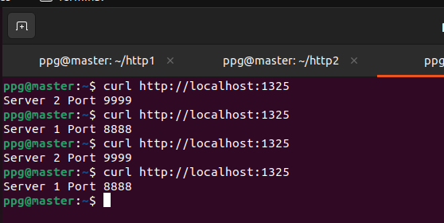
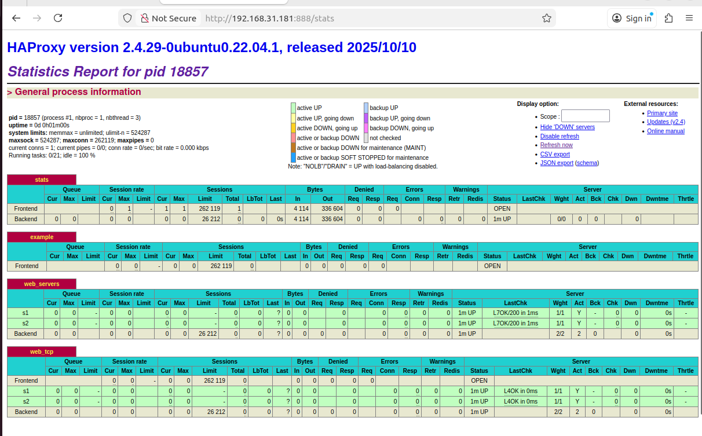
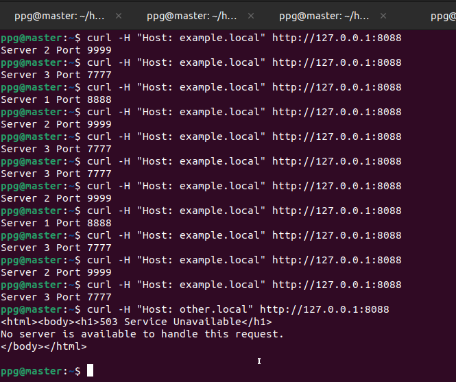
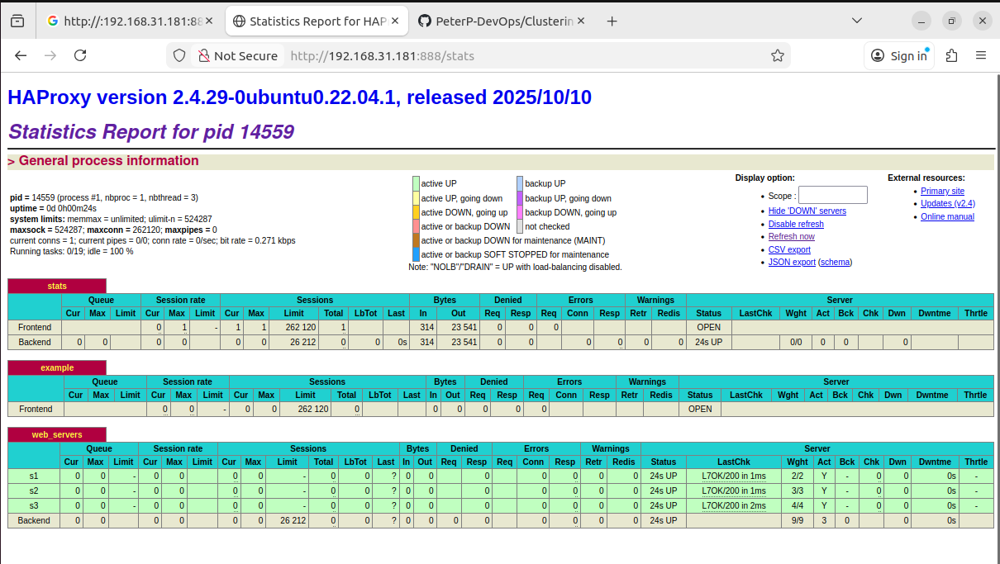

# Домашнее задание к занятию «Кластеризация и балансировка нагрузки» - Петр Петров
### Задание 1
-Запустите два simple python сервера на своей виртуальной машине на разных портах  
-Установите и настройте HAProxy, воспользуйтесь материалами к лекции по ссылке  
-Настройте балансировку Round-robin на 4 уровне.  
-На проверку направьте конфигурационный файл haproxy, скриншоты, где видно перенаправление запросов на разные серверы при обращении к HAProxy.  
### Решение 1
Конфигурационный файл haproxy:  
[Конфигурационный файл haproxy](zadanie1/haproxy.cfg)  

Скриншоты:  
Перенаправление запросов на разные серверы при обращении к HAProxy:  
  

Статистика:  
  

### Задание 2
-Запустите три simple python сервера на своей виртуальной машине на разных портах  
-Настройте балансировку Weighted Round Robin на 7 уровне, чтобы первый сервер имел вес 2, второй - 3, а третий - 4  
-HAproxy должен балансировать только тот http-трафик, который адресован домену example.local  
-На проверку направьте конфигурационный файл haproxy, скриншоты, где видно перенаправление запросов на разные серверы при обращении к HAProxy c использованием домена example.local и без него.  

### Решение 2
Конфигурационный файл haproxy с балансировкой Weighted Round Robin на 7 уровне http-трафика, который адресован домену example.local, где первый сервер имеет вес 2, второй - 3, а третий - 4  
[Конфигурационный файл haproxy](zadanie2/haproxy.cfg)  

Скриншоты:  
Перенаправление запросов на разные серверы при обращении к HAProxy c использованием домена example.local и без него  
  
Статистика:  
  

